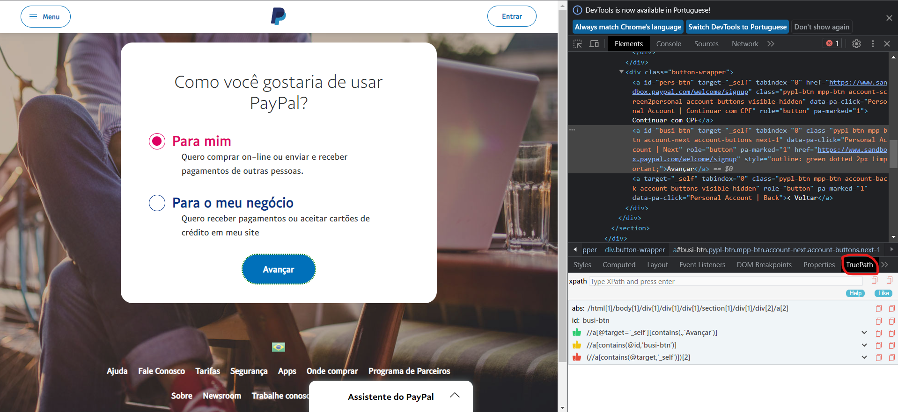

# robot-framework-web-mobile-desktop-api
Esse é um projeto pessoal que tem como objetivo me desafiar a criar uma automação usando o Robot Framework para aplicações web, mobile, desktop e api

# WEB test:

- **Sandbox PayPal**: O PayPal fornece um ambiente sandbox que permite criar contas de teste e realizar transações fictícias em que é possível praticar a automação de login, navegação e simulação de transações. Acesse-o em: https://www.sandbox.paypal.com/

- **Instalações:**
    - Robot
    - Python
    - Node.js
    - Lib Browser
    - Lib Faker

- **Libraries**:
    - **Browser:** Browser library uses Playwright Node module to automate Chromium, Firefox and WebKit with a single library.
        - enable_presenter_mode: destaca os elementos na tela, mostra as kw que está executando
        - timeout: por padrão o timeout é 10s
    - **phone-gererator.py**: código python criado para gerar um número de telefone

- **Dicas:**
    - **Busca por elementos:** [TruePath](https://chrome.google.com/webstore/detail/truepath/mgjhkhhbkkldiihlajcnlfchfcmhipmn) é uma extensão do Chrome que gera o XPath relativo, script e analisa o código ao clicar
    web-test\TruePath.png

---

# API test:
